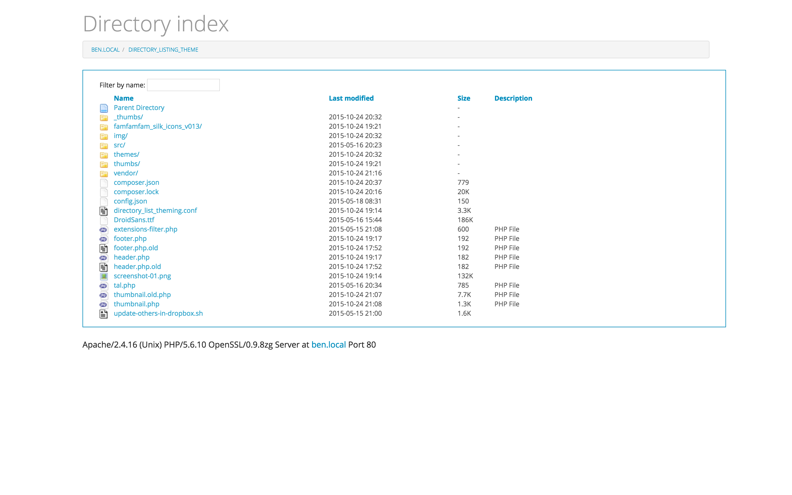

# Apache Directory List Theming

[![Waffle Icon]][Waffle Page]
[![License Badge]][License Page]
[![Version Badge]][Version Page]
[![Project Stage Badge - Development]][Project Stage Page]
[![Maintained Badge]][Maintained Page]
[![Scrutinizer Badge]][Scrutinizer Page]
[![Codacy Badge]][Codacy Page]
[![Insight Badge]][Insight Page]

## Introduction

Using basic PHP, HTML and CSS and the Apache Module [mod_autoindex], we can 
create a nicer looking directory listing. 

This project provides an easy way of achieving this. 

## What it looks like

Below is a screenshot of what the decorated result looks like.

## Installation

To enable this the following steps need to be taken:

1. A symlink needs to be create to the `directory_list_theming.conf` file from 
   the Apache config directory
2. A symlink needs to be create to the `Directory_Listing_Theme` directory from 
   the directory we want to add the functionality to. 
3. In the Apache config file the directory belongs to we need to include the 
   `directory_list_theming.conf` file.
4. The server needs to be restarted for these changes to take effect.

### Example

Say, for example, we would like to add nicer looking directory listing to the 
user directory of John on our Ubuntu machine. 

#### Step 1

First we need to create a link to `directory_list_theming.conf` from the Apache 
`sites-available` directory by calling the following command  (using `sudo` if 
we have to):

    $ ln -s /var/www/Directory_Listing_Theme/directory_list_theming.conf /etc/apache2/sites-available/directory_list_theming.conf

#### Step 2

Next we need create the symlink to the `Directory_Listing_Theme` directory from 
John's directory:

    $ ln -s /var/www/Directory_Listing_Theme/ /home/john/Directory_Listing_Theme

#### Step 3

Then we open the file `/etc/apache/sites-available/users/john.local` and add the following line:

        Include sites-available/directory_list_theming.conf

So now John's Apache Config file would look a bit like this:

    <VirtualHost *:80>
        ServerName john.local
        DocumentRoot /home/john/www/

        Include sites-available/directory_list_theming
    </VirtualHost>

#### Step 4

All that's left to do is restart the Apache Server and we're done:

    $ sudo /etc/init.d/apache2 restart

## Configuration

By default the thumbnails that are generated are stored in a directory named 
`.thumbs` in the directory where this project is located. This directory can be 
changed by setting a variable called `THUMBNAIL_DIRECTORY` to where you would 
rather have the generated thumbnails be stored. You can do this by adding the 
following line to your Apache Config file:

    	SetEnv THUMBNAIL_DIRECTORY /path/to/your/.thumbs/

## How it works

In `/etc/apache/sites-available/` there is a file called `directory_list_theming`.

If the module mod_autoindex is present and enabled it will place `/Directory_Listing_Theme/header.php`
above and `/Directory_Listing_Theme/footer.php` below the directory list. Both 
files do some checks and add some niceness like readme file inclusion, extension 
filtering and adding a nicer position header. A preview for various image formats 
in the form of a thumnail is also added.

The `IndexOptions` and various Icon directives improve the overall layout and feel
of the directory list, adding custom icons for custom filetypes.

Some CSS is added for looks and we're done.

To make sure we don't need each user to have his/her own theme directory we use
a symlink, linking to the version currently checked out of the repository. Also,
instead of having to add all those directives to each user, we simply include a 
config file for a given directory.

[mod_autoindex]: http://httpd.apache.org/docs/current/mod/mod_autoindex.html

[Codacy Badge]: https://img.shields.io/codacy/b68a50d02c804cad85f12c4feae37e7d.svg
[Codacy Page]: https://www.codacy.com/app/potherca_2612/ApacheDirectoryListTheming/
[Insight Badge]: https://img.shields.io/sensiolabs/i/a35e80d9-bf21-4afe-a4b2-127a73c5368a.svg
[Insight Page]: https://insight.sensiolabs.com/projects/a35e80d9-bf21-4afe-a4b2-127a73c5368a
[License Badge]: https://img.shields.io/badge/License-GPL3%2B-blue.svg
[License Page]: LICENSE
[Maintained Badge]: https://stillmaintained.com/potherca/ApacheDirectoryListTheming.svg
[Maintained Page]: https://stillmaintained.com/potherca/ApacheDirectoryListTheming
[Project Stage Badge - Development]: http://img.shields.io/badge/Project%20Stage-Development-yellowgreen.svg
[Project Stage Badge - Production]: http://img.shields.io/badge/Project%20Stage-Production%20Ready-brightgreen.svg
[Project Stage Page]: http://bl.ocks.org/potherca/raw/a2ae67caa3863a299ba0/
[Scrutinizer Badge]: https://img.shields.io/scrutinizer/g/potherca/ApacheDirectoryListTheming.svg
[Scrutinizer Page]: https://scrutinizer-ci.com/g/potherca/ApacheDirectoryListTheming/
[Version Badge]: http://img.shields.io/github/tag/potherca/ApacheDirectoryListTheming.svg
[Version Page]: https://github.com/potherca/ApacheDirectoryListTheming/releases 
[Waffle Icon]: https://waffle.io/favicon.ico
[Waffle Page]: https://waffle.io/Potherca/ApacheDirectoryListTheming/

<!-- EOF -->
