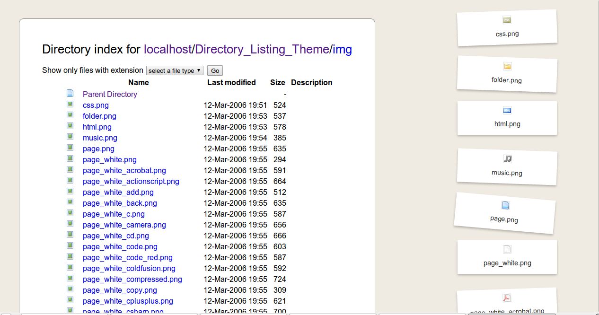

# Apache Directory List Theming

[![License Badge]][License Page]
[![Project Stage Badge - Development]][Project Stage Page]
[![Scrutinizer Badge]][Scrutinizer Page]

## Introduction

Using basic PHP, HTML and CSS and the Apache Module [mod_autoindex], one can 
create a nicer looking directory listing. 

This project provides an easy way of achieving this. 

## What it looks like

Below is a screenshot of what the decorated result looks like.

### Old-fashioned Firefox Directory Listing Theme

### Bootstrap / Bootswatch Theme

## Theming

Instead of only having the old default style, there are 16 other styles to pick 
from, based on [Bootstrap] and [Bootswatch].

Besides the "default" theme, the following themes from Bootswatch are available:

 - Cerulean
 - Cosmo
 - Cyborg
 - Darkly
 - Flatly
 - Journal
 - Lumen
 - Paper
 - Readable
 - Sandstone
 - Simplex
 - Slate
 - Spacelab
 - Superhero
 - United
 - Yeti

Please visit [Bootswatch](https://bootswatch.com/) for preview of each themes 
color scheme.

### Theme Configuration 

To activate the new theme, add a file called `config.json` with the following 
content to the root directory:

    {
        "theme" : "default"
    }

To use a different theme, simply replace `default` with the name of the theme 
that should be used.

For instance to use the _Superhero_ theme, change the contents of `config.json` 
to look like this:

    {
        "theme" : "superhero"
    }

To try out a different theme before committing to it in the `config.json`, 
simply append `?theme=superhero` to any URL to get a preview of that theme.

### Theme Customisation

To add more/other styling and/or functionality to a theme, add an `assets` 
section to the configuration. Separate sections are used for CSS and JS assets.

    {
        "theme" : "default",
        "assets" : {
            "css" : [
                "path/to/custom/theme-styling.css"
            ]
            "js" : [
                "path/to/custom/theme-functionality.js"
            ]
        }
    }

If you feel you have created something you would like to share, feel free to 
open a pull request to have it included in this project.

## Installation

To enable this the following steps need to be taken:

1. A symlink needs to be create to the `directory_list_theming.conf` file from 
   the Apache config directory
2. A symlink needs to be create to the `Directory_Listing_Theme` directory from 
   the directory we want to add the functionality to. 
3. In the Apache config file the directory belongs to we need to include the 
   `directory_list_theming.conf` file.
4. The server needs to be restarted for these changes to take effect.

### Example

Say, for example, we would like to add nicer looking directory listing to the 
user directory of John on our Ubuntu machine. 

#### Step 1

First we need to create a link to `directory_list_theming.conf` from the Apache 
`sites-available` directory by calling the following command  (using `sudo` if 
we have to):

    $ ln -s /var/www/Directory_Listing_Theme/directory_list_theming.conf /etc/apache2/sites-available/directory_list_theming.conf

#### Step 2

Next we need create the symlink to the `Directory_Listing_Theme` directory from 
John's directory:

    $ ln -s /var/www/Directory_Listing_Theme/ /home/john/Directory_Listing_Theme

#### Step 3

Then we open the file `/etc/apache/sites-available/users/john.local` and add the following line:

        Include sites-available/directory_list_theming.conf

So now John's Apache Config file would look a bit like this:

    <VirtualHost *:80>
        ServerName john.local
        DocumentRoot /home/john/www/

        Include sites-available/directory_list_theming
    </VirtualHost>

#### Step 4

All that's left to do is restart the Apache Server and we're done:

    $ sudo /etc/init.d/apache2 restart

## Configuration

By default the thumbnails that are generated are stored in a directory named 
`.thumbs` in the directory where this project is located. This directory can be 
changed by setting a variable called `THUMBNAIL_DIRECTORY` to where you would 
rather have the generated thumbnails be stored. You can do this by adding the 
following line to your Apache Config file:

        SetEnv THUMBNAIL_DIRECTORY /path/to/your/.thumbs/

## How it works

In `/etc/apache/sites-available/` there is a file called `directory_list_theming`.

If the module mod_autoindex is present and enabled it will place `/Directory_Listing_Theme/header.php`
above and `/Directory_Listing_Theme/footer.php` below the directory list. Both 
files do some checks and add some niceness like readme file inclusion, extension 
filtering and adding a nicer position header. A preview for various image formats 
in the form of a thumnail is also added.

The `IndexOptions` and various Icon directives improve the overall layout and feel
of the directory list, adding custom icons for custom filetypes.

Some CSS is added for looks and we're done.

To make sure we don't need each user to have his/her own theme directory we use
a symlink, linking to the version currently checked out of the repository. Also,
instead of having to add all those directives to each user, we simply include a 
config file for a given directory.

[mod_autoindex]: http://httpd.apache.org/docs/current/mod/mod_autoindex.html
[Bootstrap]: https://bootswatch.com/
[BootSwatch]: http://getbootstrap.com/

[License Badge]: https://img.shields.io/badge/License-GPL3%2B-blue.svg
[License Page]: LICENSE
[Project Stage Badge - Development]: http://img.shields.io/badge/Project%20Stage-Development-yellowgreen.svg
[Project Stage Badge - Production]: http://img.shields.io/badge/Project%20Stage-Production%20Ready-brightgreen.svg
[Project Stage Page]: http://bl.ocks.org/potherca/raw/a2ae67caa3863a299ba0/
[Scrutinizer Badge]: https://img.shields.io/scrutinizer/g/potherca/ApacheDirectoryListTheming.svg
[Scrutinizer Page]: https://scrutinizer-ci.com/g/potherca/ApacheDirectoryListTheming/

<!-- EOF -->

## License

